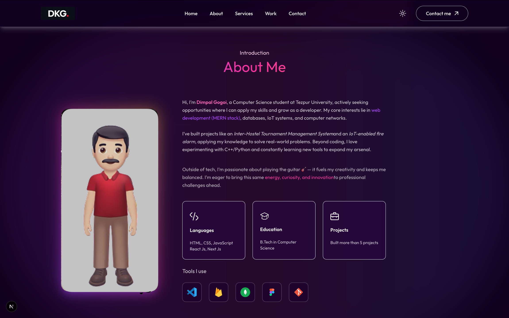

<h1 align="center">🌌 Portfolio – Next.js + Tailwind CSS</h1>

<p align="center">
  <em>A modern, responsive portfolio built with ⚛️ Next.js & 🎨 Tailwind CSS</em><br/>
  <sub>Showcase your <strong>skills</strong>, <strong>projects</strong>, and <strong>contact info</strong> with style ✨</sub>
</p>

---

<p align="center">
  <a href="https://nextjs.org/"></a>
  <a href="https://tailwindcss.com/"></a>
  <a href="https://framer.com/motion"></a>
</p>

---

## ✨ Highlights (click to expand)

<details>
<summary>🚀 Tech Features</summary>

- ⚡ **Next.js 14+ App Router**
- 🎨 **Tailwind CSS v4** (utility-first styling)
- 🌙 **Dark mode toggle**
- 📱 **Fully responsive** for all devices
- 🖼️ Optimized images with `next/image`
- 🧩 Modular components (Navbar, Footer, Header, etc.)
- 🎬 Smooth animations via **Framer Motion**

</details>

<details>
<summary>⚡ Quick Peek</summary>

```bash
# 1️⃣ Install dependencies
npm install   # or yarn / pnpm install

# 2️⃣ Run development server
npm run dev   # (http://localhost:3000)

# 3️⃣ Build & Deploy
npm run build && vercel
```
</details>

---

## 🛠️ Customization Guide

**Where to edit?**

- `app/components/` → Update your Navbar, Footer, Services, etc.
- `assets/` → Replace images/icons with your own
- `app/globals.css` → Override styles or extend Tailwind
- `layout.js` / `page.js` → Root layout & homepage logic

💡 *Pro tip: Fonts are handled via next/font.*

---

## 📂 Project Structure

```
app/
  ├── components/      # Reusable React components (Navbar, Footer, etc.)
  ├── assets/          # Images and icons
  ├── globals.css      # Tailwind import & global styles
  ├── layout.js        # Root layout
  └── page.js          # Landing page
public/
README.md
package.json
```

---

## 🌑 Dark Mode Support

- Toggle Dark/Light Mode in the Navbar
- Powered by Tailwind’s `dark:` classes & dark mode config
- 🌓 Yes, it remembers your choice even after refresh!

---

## 📦 Deployment(upcomming)

- Easiest way: Deploy with Vercel ⚡
- or use any platform that supports Next.js.

---

## 📸 Sneak Peek

<p align="center">  <br/> <sub><em>“Hello World but make it aesthetic.”</em></sub> </p>

---

## 🧩 Learn More

- 📖 [Next.js Docs](https://nextjs.org/docs)
- 🎨 [Tailwind Docs](https://tailwindcss.com/docs)
- 🎬 [Framer Motion](https://www.framer.com/motion/)

---

## 📝 License

Open source under MIT.  
Feel free to use, but a ⭐ on the repo makes my day.

<p align="center"> Made with ❤️ by <strong>Dimpal Gogoi</strong> <br/> <sub>(and an unhealthy amount of coffee)</sub> </p>